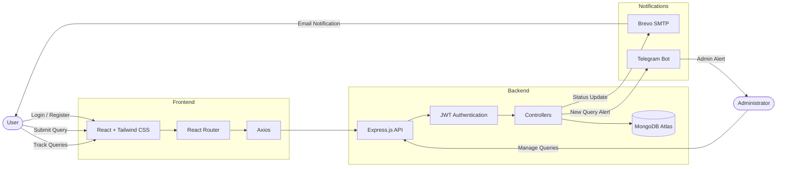

<div align="center">

# QueryFlow 💬

### Modern Full-Stack Query Management System with Secure Authentication, Real-Time Tracking, Email Notifications & Telegram Alerts

<p>
  <a href="https://query-management-system-one.vercel.app"><strong>🌐 Live Demo</strong></a> •
  <a href="https://query-management-system-e8a3.onrender.com"><strong>🚀 Backend API</strong></a> •
  <a href="https://github.com/saikat-codes/query-management-system/issues"><strong>🐞 Report Bug</strong></a>
</p>

<br>

[](https://nodejs.org)
[](https://expressjs.com)
[](https://mongodb.com)
[](https://reactjs.org)
[](https://reactrouter.com)
[](https://tailwindcss.com)
[](https://axios-http.com)
[](https://jwt.io)
[](https://core.telegram.org/bots/api)
[](https://git-scm.com)
[](https://github.com)
[](https://vercel.com)
[](https://render.com)


</div>

---

# 📖 Overview

QueryFlow is a **full-stack MERN application** that enables users to submit and track support queries while providing administrators with a dedicated dashboard for efficient query management.

The application features **JWT authentication, real-time query tracking, automated email notifications, Telegram alerts, and cloud deployment**, demonstrating modern full-stack development practices.

---

# 🏗 System Architecture



---

# ✨ Features

### 👤 User Features

- 🔐 Secure user registration & login
- 🍪 JWT authentication using HttpOnly cookies
- 📝 Submit support queries
- 📋 Track submitted queries
- 📜 View complete query history
- 🟢 Real-time status badges
- 📱 Responsive interface across devices

### 🛠 Admin Features

- ⚙️ Dedicated admin dashboard
- 📂 View all submitted queries
- ✏️ Update query status
- 🗑 Delete queries
- 📧 Automatic email notifications
- 📲 Instant Telegram alerts

### 🔒 Security

- JWT Authentication
- Protected Routes
- Password hashing with bcrypt
- HttpOnly Cookies
- Environment-based configuration
- Secure CORS handling

---

# 🎥 Demo

<p align="center">
  <a href="https://youtu.be/IcnsgxBToK0" target="_blank">
    
  </a>
</p>

<p align="center">
  <strong>▶️ Click the image above to watch the full demo (1 min 20 sec)</strong>
</p>

---

# 📸 Interface Preview

<div align="center">

### 👤 User Dashboard


<br><br>

### ⚙️ Admin Dashboard


<br><br>

### 📧 Email Notification


</div>

---

# 🛠 Tech Stack

| Category | Technologies |
|----------|--------------|
| **Frontend** | React, React Router DOM, Tailwind CSS, Axios, JavaScript, HTML5, CSS3 |
| **Backend** | Node.js, Express.js, MongoDB Atlas, Mongoose, JWT Authentication, Cookie Parser, bcryptjs |
| **Integrations** | Brevo SMTP API, Telegram Bot API |
| **Deployment** | Vercel, Render |

---

# 🔐 Demo Access

| Panel | URL | Credentials |
|------|------|-------------|
| **Admin Panel** | `/admin` | `admin123` |
| **Query Tracker** | `/track` | Login using any registered user account |

---

# 📡 API Reference

### Base URL

```text
https://query-management-system-e8a3.onrender.com
```

## Authentication Endpoints

| Method | Endpoint | Description |
|---------|----------|-------------|
| `POST` | `/api/auth/register` | Register a new user |
| `POST` | `/api/auth/login` | Login user |
| `POST` | `/api/auth/logout` | Logout user |
| `GET` | `/api/auth/me` | Get authenticated user |

---

## Query Endpoints

| Method | Endpoint | Description | Authentication |
|---------|----------|-------------|----------------|
| `POST` | `/api/queries` | Submit a new query | ✅ |
| `GET` | `/api/queries/my` | Get current user's queries | ✅ |
| `GET` | `/api/queries` | Get all queries | Admin |
| `PUT` | `/api/queries/:id` | Update query status | Admin |
| `DELETE` | `/api/queries/:id` | Delete query | Admin |

---

## Example Request

### POST `/api/queries`

```json
{
  "name": "Saikat Das",
  "message": "I need help configuring my dashboard."
}
```

---

## Example Response

```json
{
  "_id": "65f3a1b2c3d4e5f6a7b8c9d0",
  "name": "Saikat Das",
  "email": "saikat@gmail.com",
  "message": "I need help configuring my dashboard.",
  "status": "pending",
  "userId": "65f3a0a1b2c3d4e5f6a7b8c9",
  "createdAt": "2026-07-09T14:12:00.312Z",
  "updatedAt": "2026-07-09T14:12:00.312Z"
}
```

---

# 🚀 Getting Started

## 1️⃣ Clone the Repository

```bash
git clone https://github.com/saikat-codes/query-management-system.git

cd query-management-system
```

---

## 2️⃣ Backend Setup

Navigate to the backend directory.

```bash
cd backend

npm install
```

Create a `.env` file inside the `backend` folder.

```env
MONGO_URI=your_mongodb_connection_string

BREVO_API_KEY=your_brevo_api_key

MAIL_FROM=your_verified_sender_email

TELEGRAM_TOKEN=your_bot_token

TELEGRAM_CHAT_ID=your_chat_id

JWT_SECRET=your_secret_key

NODE_ENV=development

PORT=5000
```

Start the backend server.

```bash
npm run dev
```

---

## 3️⃣ Frontend Setup

Navigate to the frontend directory.

```bash
cd ../frontend

npm install
```

Create a `.env` file.

```env
VITE_API_URL=http://localhost:5000/api/queries

VITE_BASE_URL=http://localhost:5000

VITE_AUTH_PASSWORD=admin123
```

Run the development server.

```bash
npm run dev
```

---

## 4️⃣ Local Development

| Service | URL |
|---------|-----|
| Frontend | http://localhost:5173 |
| Backend | http://localhost:5000 |

---

# 📁 Project Structure

```text
query-management-system
│
├── backend
│   ├── config
│   │   └── db.js
│   │
│   ├── controllers
│   │   ├── authController.js
│   │   └── queryController.js
│   │
│   ├── middleware
│   │   └── protect.js
│   │
│   ├── models
│   │   ├── User.js
│   │   └── Query.js
│   │
│   ├── routes
│   │   ├── authRoutes.js
│   │   └── queryRoutes.js
│   │
│   ├── utils
│   │   └── notifications.js
│   │
│   └── app.js
│
├── frontend
│   └── src
│       ├── api
│       ├── components
│       ├── pages
│       ├── assets
│       └── App.jsx
│
├── screenshots
│   ├── user-page.png
│   ├── admin-panel.png
│   └── email-notification.png
│
└── README.md
```

---

# 🌍 Deployment

## Frontend

**Platform:** Vercel

```
https://query-management-system-one.vercel.app
```

---

## Backend

**Platform:** Render

```
https://query-management-system-e8a3.onrender.com
```

---

## Database

**MongoDB Atlas**


---
# 📬 Notifications

QueryFlow automatically keeps users and administrators updated through integrated notification services.

### 📧 Email Notifications

- Query status updates
- HTML email templates
- Powered by **Brevo SMTP**

### 📲 Telegram Notifications

- New query alerts
- Admin activity notifications
- Powered by the **Telegram Bot API**

Telegram Bot:

**https://t.me/queryflow_notify_bot**

---

# 👨‍💻 Author

<div align="center">

### Saikat Das

<p>
<a href="https://github.com/saikat-codes">

</a>
</p>

</div>

---

<div align="center">

### ⭐ Star this repository if you found it useful!


**Made with ❤️ by Saikat Das**

</div>
