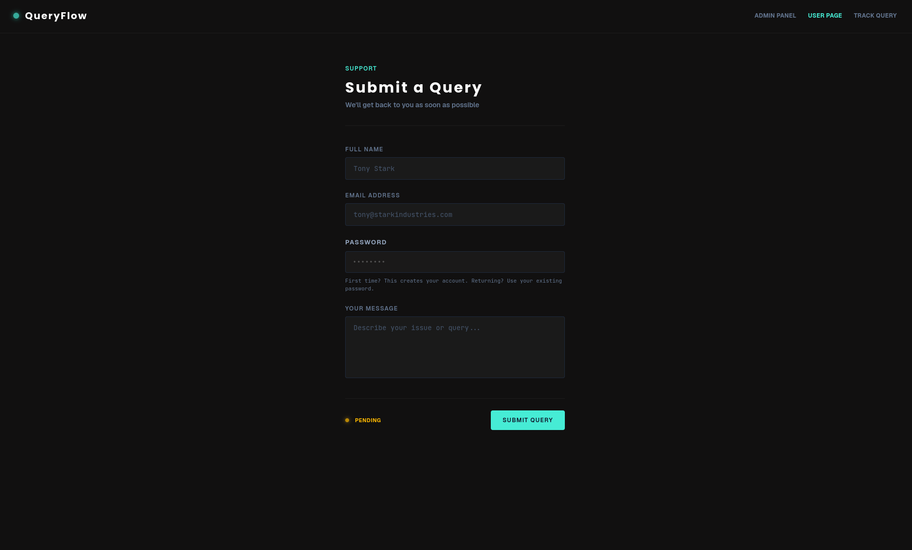
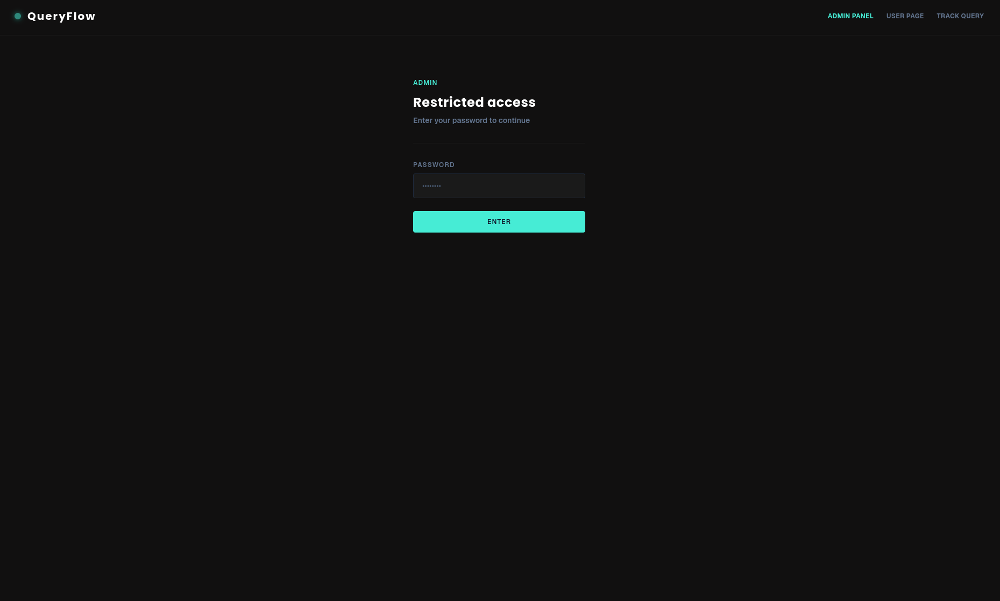
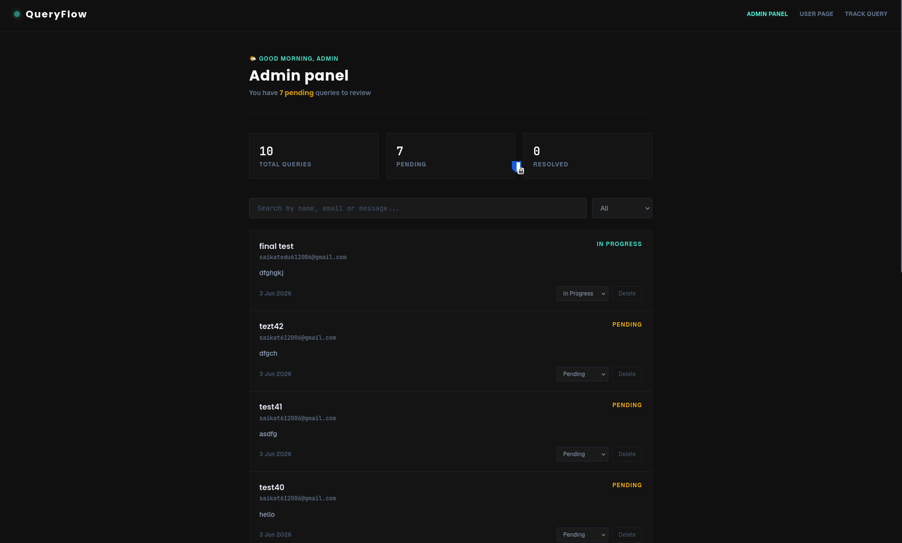
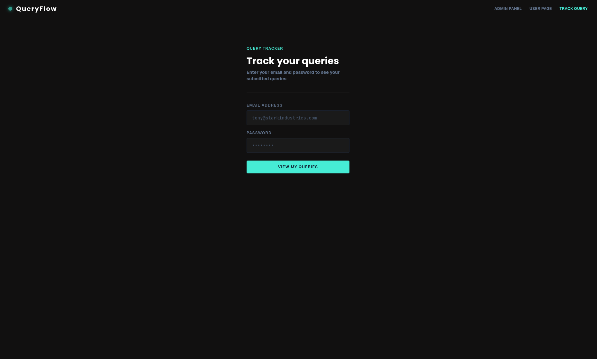
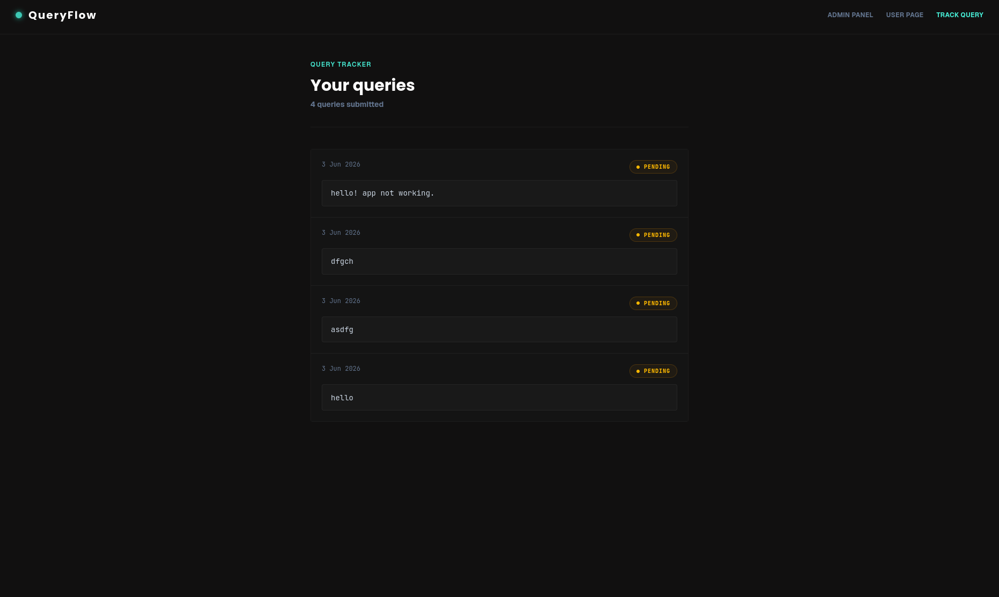
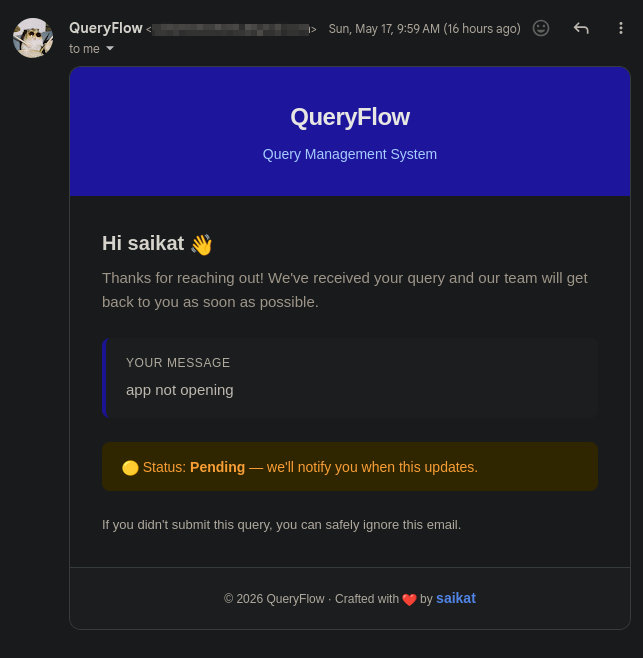

<div align="center">

# QueryFlow 💬

**A full-stack query management system with real-time email and Telegram notifications.**

[](https://nodejs.org)
[](https://expressjs.com)
[](https://mongodb.com)
[](https://reactjs.org)
[](https://tailwindcss.com)
[](https://jwt.io)
[](https://vercel.com)
[](https://render.com)

[Live Demo](https://query-management-system-one.vercel.app) · [Backend API](https://query-management-system-e8a3.onrender.com) · [Report Bug](https://github.com/saikat-codes/query-management-system/issues)

</div>

---

## 📸 Screenshots

<div align="center">

### 👤 User Page


<br>

### 🔐 Admin Login


<br>

### ⚙️ Admin Panel


<br>

### 🔍 Query Tracker Login


<br>

### 📋 Query Tracker Panel


<br>

### 📧 Email Notification


</div>

---

## ✨ Features

### 👤 User
- Submit queries with name, email, password and message
- First submission creates an account automatically
- Instant styled HTML email confirmation on submission
- Real-time Telegram notification on submission
- Email notification on every status change

### 🔍 Query Tracker
- Login with email and password to track your queries
- See all submitted queries and their current statuses
- Status updates reflected in real time

### 🛠 Admin
- Password-protected admin panel
- View all submitted queries in real time
- Update query status — Pending → In Progress → Resolved
- Delete queries
- Search queries by name, email or message
- Filter queries by status
- Live stats dashboard — total, pending, resolved counts
- Time-aware greeting (morning, afternoon, evening, night)

### 🔔 Notifications
- Styled HTML email notifications via Brevo Transactional Email API
- Telegram notifications via [@queryflow_notify_bot](https://t.me/queryflow_notify_bot)
- Dynamic styling per status — 🟡 Pending · 🔵 In Progress · 🟢 Resolved
- Notifications fire on query submission and every status change

---

## 🛠 Tech Stack

| Layer | Technology |
|---|---|
| Frontend | React 19, Vite, Tailwind CSS |
| Backend | Node.js, Express.js |
| Database | MongoDB Atlas, Mongoose |
| Auth | JWT, bcryptjs, httpOnly Cookies |
| Email | Brevo Transactional Email API |
| Telegram | Telegram Bot API + Axios |
| Deployment | Vercel (frontend), Render (backend) |

---

## 🔐 Demo Access

| Panel | URL | Password |
|---|---|---|
| Admin | [/admin](https://query-management-system-one.vercel.app/admin) | `admin123` |
| Track Query | [/track](https://query-management-system-one.vercel.app/track) | Use email + password from submission |

---

## 📡 API Reference

Base URL: `https://query-management-system-e8a3.onrender.com`

### Queries

| Method | Endpoint | Description | Auth |
|---|---|---|---|
| `POST` | `/api/queries` | Submit a new query | No |
| `GET` | `/api/queries` | Get all queries | No |
| `GET` | `/api/queries/my` | Get logged in user's queries | ✅ Cookie |
| `PUT` | `/api/queries/:id` | Update query status | No |
| `DELETE` | `/api/queries/:id` | Delete a query | No |

### Auth

| Method | Endpoint | Description |
|---|---|---|
| `POST` | `/api/auth/register` | Register a new user |
| `POST` | `/api/auth/login` | Login and receive cookie |
| `POST` | `/api/auth/logout` | Clear auth cookie |
| `GET` | `/api/auth/me` | Get current user |

### Example Request — Submit a query
```json
POST /api/queries
{
  "name": "Saikat Das",
  "email": "saikat@gmail.com",
  "password": "yourpassword",
  "message": "I need help with my account"
}
```

### Example Response
```json
{
  "_id": "abc123",
  "name": "Saikat Das",
  "email": "saikat@gmail.com",
  "message": "I need help with my account",
  "status": "pending",
  "userId": "xyz456",
  "createdAt": "2026-05-17T10:00:00.000Z",
  "updatedAt": "2026-05-17T10:00:00.000Z"
}
```

---

## 🚀 Getting Started

### Prerequisites
- Node.js v18+
- MongoDB Atlas account (free tier)
- Brevo account (free tier — 300 emails/day)
- Telegram bot token from [@BotFather](https://t.me/BotFather)

### 1 — Clone the repo
```bash
git clone https://github.com/saikat-codes/query-management-system.git
cd query-management-system
```

### 2 — Setup Backend
```bash
cd backend
npm install
```

Create a `.env` file in the `backend/` folder:
```env
MONGO_URI=your_mongodb_connection_string
BREVO_API_KEY=your_brevo_api_key
MAIL_FROM=your_verified_sender_email
TELEGRAM_TOKEN=your_telegram_bot_token
TELEGRAM_CHAT_ID=your_telegram_chat_id
JWT_SECRET=your_jwt_secret_key
NODE_ENV=development
```

Start the backend:
```bash
npm run dev
```

### 3 — Setup Frontend
```bash
cd ../frontend
npm install
```

Create a `.env` file in the `frontend/` folder:
```env
VITE_API_URL=http://localhost:5000/api/queries
VITE_BASE_URL=http://localhost:5000
VITE_AUTH_PASSWORD=admin123
```

Start the frontend:
```bash
npm run dev
```

### 4 — Open the app
```
Frontend → http://localhost:5173
Backend  → http://localhost:5000
```

---

## 📁 Folder Structure

```
query-management-system/
│
├── backend/
│   ├── config/
│   │   └── db.js
│   ├── controllers/
│   │   ├── authController.js
│   │   └── queryController.js
│   ├── middleware/
│   │   └── protect.js
│   ├── models/
│   │   ├── User.js
│   │   └── Query.js
│   ├── routes/
│   │   ├── authRoutes.js
│   │   └── queryRoutes.js
│   ├── utils/
│   │   └── notifications.js
│   └── app.js
│
├── frontend/
│   └── src/
│       ├── api/
│       │   ├── auth.js
│       │   └── queries.js
│       ├── components/
│       │   └── Navbar.jsx
│       ├── pages/
│       │   ├── UserPage.jsx
│       │   ├── AdminPage.jsx
│       │   └── TrackPage.jsx
│       └── App.jsx
│
├── screenshots/
└── README.md
```

---

## 🌐 Deployment

| Service | Platform | URL |
|---|---|---|
| Frontend | Vercel | [query-management-system-one.vercel.app](https://query-management-system-one.vercel.app) |
| Backend | Render | [query-management-system-e8a3.onrender.com](https://query-management-system-e8a3.onrender.com) |
| Database | MongoDB Atlas | Cloud hosted |

### Render Environment Variables
```
MONGO_URI
BREVO_API_KEY
MAIL_FROM
TELEGRAM_TOKEN
TELEGRAM_CHAT_ID
JWT_SECRET
NODE_ENV=production
```

### Vercel Environment Variables
```
VITE_API_URL=https://query-management-system-e8a3.onrender.com/api/queries
VITE_BASE_URL=https://query-management-system-e8a3.onrender.com
VITE_AUTH_PASSWORD=admin123
```

---

## 📬 Telegram Bot

Notifications are delivered via **QueryFlow Bot** on Telegram.

👉 [@queryflow_notify_bot](https://t.me/queryflow_notify_bot)

---

<div align="center">
  <p>Built with ❤️ by <a href="https://github.com/saikat-codes">saikat-codes</a></p>
</div>
